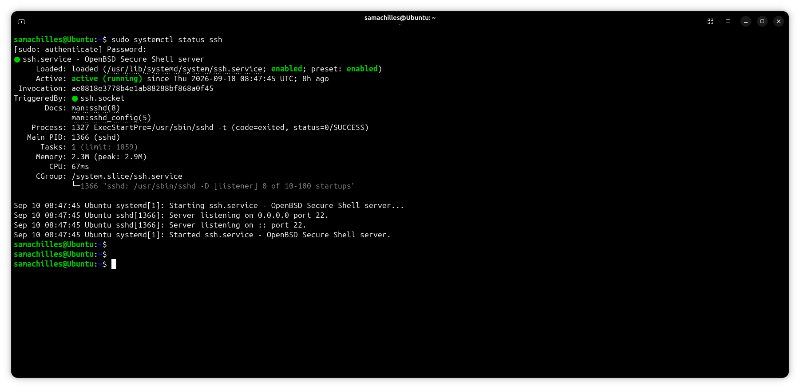
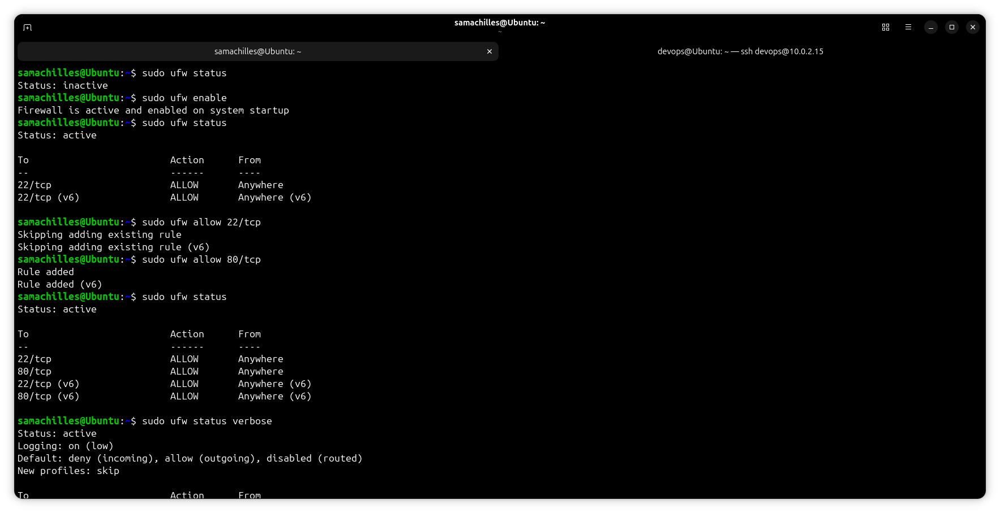
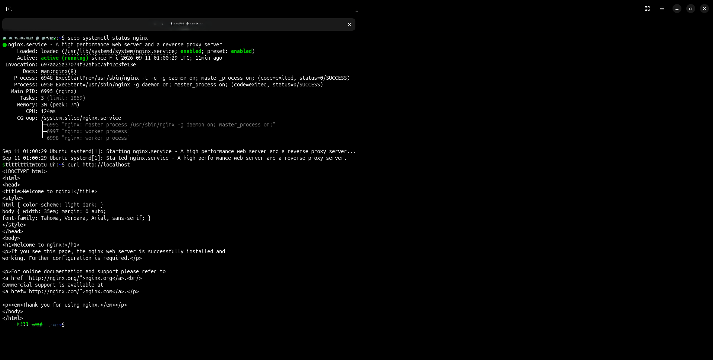
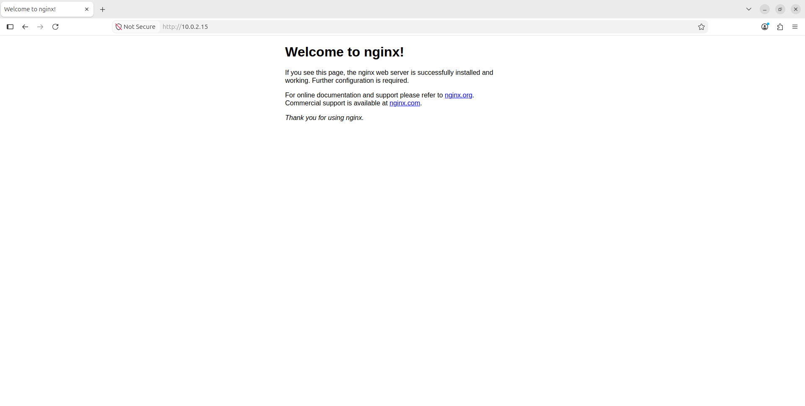
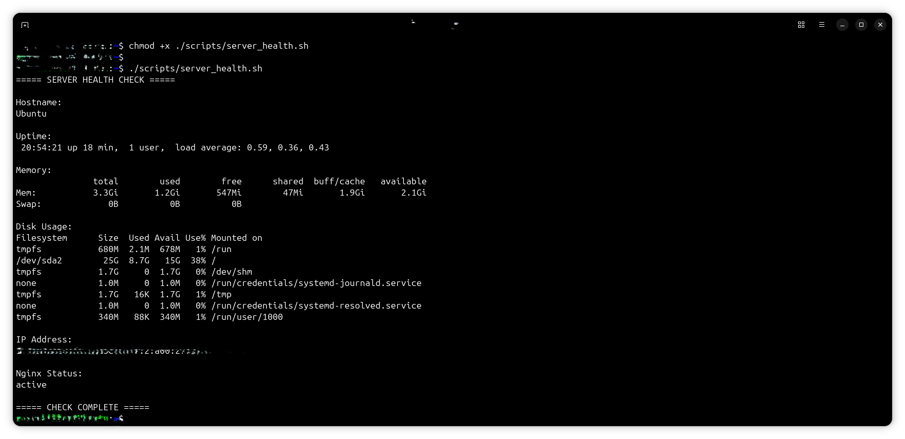
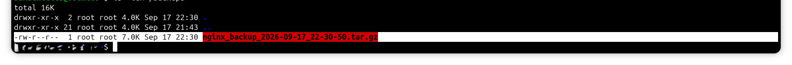

# Setup Guide

## 1. Overview

This guide documents how I set up and configured the Linux server for this project.

I provisioned **Ubuntu Server as a virtual machine using VirtualBox** and carried out the server administration tasks from the command line. The `samachilles` account was used for the main administration and configuration work.

I also created two additional users for specific purposes:

| User          | Purpose                                         |
| ------------- | ----------------------------------------------- |
| `samachilles` | Primary server administrator                    |
| `devops`      | SSH access verification                         |
| `appuser`     | Application ownership and permission management |

> **Note:** The `devops` user was created to verify SSH access to a separate account. The actual server administration and configuration activities were carried out under `samachilles`. The `appuser` account was created to demonstrate application ownership and file permissions.

The setup covered:

* Initial Ubuntu Server preparation
* System package updates
* User and permission management
* SSH configuration and access verification
* Firewall configuration using UFW
* Nginx installation and configuration
* Web content deployment
* Bash automation scripts
* Backup configuration
* Server verification

---

# 2. Prerequisites

For this project, I used:

* VirtualBox
* Ubuntu Server
* A configured Ubuntu Server virtual machine
* Network connectivity
* SSH client
* A user account with `sudo` privileges
* Basic Linux command-line knowledge

---

# 3. Initial Server Setup

## 3.1 Provision Ubuntu Server

I installed **Ubuntu Server as a virtual machine in VirtualBox**.

After completing the installation, I logged into the server using the primary account:

```text
samachilles
```

This became the main account used throughout the project for system administration and configuration.

---

## 3.2 Verify the Current User

I first confirmed the account currently being used:

```bash
whoami
```

Expected output:

```text
samachilles
```

I also checked the server hostname:

```bash
hostname
```

These checks confirmed the user account and server environment before continuing with the configuration.

---

## 3.3 Update the Package Repository

I updated the package repository:

```bash
sudo apt update
```

Then upgraded the installed packages:

```bash
sudo apt upgrade -y
```

This ensured that the server had an updated package environment before installing and configuring additional services.

---

## 3.4 Verify System Information

I checked the Ubuntu operating system information:

```bash
cat /etc/os-release
```

The Linux kernel was checked using:

```bash
uname -a
```

I also checked the server uptime:

```bash
uptime
```

Or you could verify with combined commands:

```bash
hostname && uname -a && lscpu && free -h && df -h && ip addr
```

These commands provided a basic overview of the server environment.

---

# 4. User and Permission Management

I created additional users to demonstrate different responsibilities and Linux permission concepts.

The three accounts used in the project were:

* `samachilles` — primary administrator
* `devops` — SSH access verification
* `appuser` — application ownership and permissions

The main administration work remained under `samachilles`.

---

## 4.1 Create the `devops` User

I created the `devops` account:

```bash
sudo adduser devops
```

I added the account to the `sudo` group:

```bash
sudo usermod -aG sudo devops
```

I then verified its group membership:

```bash
groups devops
```

The purpose of this account was primarily to test SSH access using a separate user rather than the primary administrator account.

---

## 4.2 Create the `appuser` User

I created a separate application user:

```bash
sudo adduser appuser
```

The purpose of `appuser` was to represent the owner of application-related files and directories.

For example, I created an application directory:

```bash
sudo mkdir -p /opt/myapp
```

Ownership could then be assigned to the application user:

```bash
sudo chown -R appuser:appuser /opt/myapp
```

This helped demonstrate how Linux separates application ownership from general server administration.

---

## 4.3 Inspect File Permissions

I inspected files and directories using:

```bash
ls -la
```

and:

```bash
ls -l
```

I used `chmod` and `chown` when permissions or ownership needed to be changed.

For example:

```bash
sudo chmod 640 /opt/myapp/app.log
```

In one instance, running `chmod` without `sudo` resulted in a permission-denied error. Running the same command with `sudo` allowed the permission change to be completed.

This helped reinforce how Linux permissions determine what individual users and groups can access or modify.

---

# 5. SSH Configuration

## 5.1 Verify the SSH Service

I checked whether the SSH service was running:

```bash
sudo systemctl status ssh
```

If necessary, the service can be started with:

```bash
sudo systemctl start ssh
```

I also enabled SSH to start automatically:

```bash
sudo systemctl enable ssh
```

---

## 5.2 Test SSH Access

After creating the `devops` account, I used it to verify SSH access to the server.

From the client machine, I connected using:

```bash
ssh devops@10.x.x.x
```

Once connected, I verified the account:

```bash
whoami
```

and checked the hostname:

```bash
hostname
```



The successful connection confirmed that remote SSH access was working correctly.

> **Note:** SSH access was tested using `devops`, but the subsequent server administration and configuration work was performed under `samachilles`.

---

# 6. Firewall Configuration

## 6.1 Install UFW(Uncomplicated Firewall)

I installed UFW if it was not already available:

```bash
sudo apt install ufw -y
```

I then checked its current status:

```bash
sudo ufw status
```

---

## 6.2 Allow Required Services

Because SSH was being used for remote access, I allowed port `22`:

```bash
sudo ufw allow 22/tcp
```

I also allowed HTTP traffic for the Nginx web server:

```bash
sudo ufw allow 80/tcp
```

Check:

```bash
sudo ufw status numbered
```

---

## 6.3 Enable the Firewall

I enabled UFW:

```bash
sudo ufw enable
```

The configuration was then verified:

```bash
sudo ufw status verbose
```



This confirmed that the required ports were allowed while the firewall was active.

---

# 7. Install Nginx

## 7.1 Install Nginx

I installed Nginx using:

```bash
sudo apt install nginx -y
```

After installation, I checked the service:

```bash
sudo systemctl status nginx
```

---

## 7.2 Enable Nginx

I configured Nginx to start automatically when the server boots:

```bash
sudo systemctl enable nginx
```

If required, it can be started manually with:

```bash
sudo systemctl start nginx
```

I installed and configured Nginx as the web server. I enabled the service to start automatically at system boot and validated its configuration to ensure everything was correct before deployment.



---

## 7.3 Verify Nginx

I checked whether Nginx was listening for network connections:

```bash
sudo ss -tulpn | grep nginx
```

I also tested the default HTTP response locally:

```bash
curl http://localhost
```

A successful response confirmed that Nginx was serving HTTP requests.



---

# 8. Configure the Web Content

## 8.1 Create the Web Directory

I created a directory for the project website:

```bash
sudo mkdir -p /var/www/web-content
```

I then assigned ownership:

```bash
sudo chown -R $USER:$USER /var/www/web-content
```

---

## 8.2 Create the Web Page

I created a custom HTML page:

```bash
vim /var/www/web-content/index.html
```

The page contained simple content to demonstrate that the Nginx web server was working.

Example:

```html
<!DOCTYPE html>
<html>
<head>
    <title>Linux Server Administration</title>
</head>
<body>
    <h1>Linux Server is Running</h1>
    <p>Server administered by Sam Achilles.</p>
    <p>Ubuntu + Nginx</p>
</body>
</html>
```

Save the file and exit.

---

# 9. Configure Nginx (Server Block)

I created a custom Nginx server block:

```bash
sudo vim /etc/nginx/sites-available/server-block
```

The configuration points Nginx to the project website directory:

```nginx
server {
    listen 80;
    server_name _;

    root /var/www/web-content;
    index index.html;

    location / {
        try_files $uri $uri/ =404;
    }
}
```

Enabled the configuration by creating a symbolic link:

```bash
sudo ln -s /etc/nginx/sites-available/server-block /etc/nginx/sites-enabled/server-block
```

Remove the default Nginx page:

```bash
sudo rm /etc/nginx/sites-enabled/default
```

Tested the configuration:

```bash
sudo nginx -t
```

After the configuration test completed successfully, reload Nginx:

```bash
sudo systemctl reload nginx
```

Or start Nginx again:

```bash
sudo systemctl start nginx
```

> **Note:** The custom server block was necessary to serve the project webpage from `/var/www/web-content`.

---

# 10. Verify the Web Server

I tested the website locally:

```bash
curl http://localhost
```

If the VM's IP address was reachable from the client machine, the webpage could also be accessed through:

```text
http://10.x.x.x
```

The configured webpage confirmed that Nginx was correctly serving the project content.

This verification confirmed that:

* Nginx was running
* HTTP traffic was available
* The custom server block was active
* The website files were being served correctly

---

# 11. Create the Server Health Check Script

I created a Bash script to collect basic information about the server:

```bash
vim scripts/server_health.sh
```

The script collects information such as:

* Hostname
* Uptime
* CPU information
* Memory usage
* Disk usage
* Network information
* Service status

Made it executable:

```bash
chmod +x scripts/server_health.sh
```

Then ran it:

```bash
./scripts/server_health.sh
```

The output was captured as project evidence in:



---

# 12. Create the Backup Script (Nginx Config Files)

I created a Bash backup script:

```bash
vim scripts/backup.sh
```

The script creates a compressed backup of Nginx Configuration files.

I made it executable:

```bash
chmod +x scripts/backup.sh
```

Then ran the script:

```bash
./scripts/backup.sh
```

Verify the generated backup using:

```bash
ls -lh
```

A timestamped backup archive was created in the configured backup location.



This provided practical experience with basic backup automation using Bash.

---

# 13. Service Verification

After completing the configuration, I verified the major services and system resources.

### Check SSH

```bash
sudo systemctl status ssh
```

### Check Nginx

```bash
sudo systemctl status nginx
```

### Check Firewall

```bash
sudo ufw status verbose
```

### Check Listening Ports

```bash
sudo ss -tulpn
```

### Check Disk Usage

```bash
df -h
```

### Check Memory

```bash
free -h
```

### Check Uptime

```bash
uptime
```

These checks helped confirm that the main services and system resources were functioning as expected.

---

# 14. Final Validation

I used the following checklist to validate the completed environment:

| Component             | Verification                                |
| --------------------- | ------------------------------------------- |
| Ubuntu Server VM      | Provisioned and operational in VirtualBox   |
| Primary administrator | `samachilles` verified                      |
| SSH                   | Access verified using `devops`              |
| Application user      | `appuser` created for application ownership |
| User management       | Users and groups verified                   |
| File permissions      | Ownership and permissions inspected         |
| UFW                   | Required ports allowed                      |
| Nginx                 | Service running                             |
| HTTP                  | Webpage accessible                          |
| Bash health check     | Script executes successfully                |
| Backup                | Backup archive created                      |
| Server resources      | Disk, memory and uptime checked             |

---

# 15. Project Evidence

Screenshots documenting the implementation are stored in:

```text
screenshots/
```

Relevant evidence includes:

* `server-info.png` — Ubuntu Server/system information
* `ssh.png` — Successful SSH connection using `devops`
* `firewall.png` — UFW configuration
* `nginx.png` — Nginx service and web server
* `health-check.png` — Server health-check script
* `backup.png` — Backup script execution

These screenshots provide visual evidence of the configuration and verification steps carried out during the project.

---

# 16. Result

The completed project established a functional Ubuntu Server environment running as a VirtualBox virtual machine.

Through the setup, I implemented:

* Remote administration through SSH
* Separate Linux user accounts for different responsibilities
* User, group and file permission management
* Firewall configuration using UFW
* Nginx installation and web server configuration
* Custom web content deployment
* Bash-based server health monitoring
* Automated file backups
* Basic service and resource verification

This project gave me practical experience with Linux server administration and provided a foundation for progressing into cloud infrastructure, containerization, Infrastructure as Code, and CI/CD.
